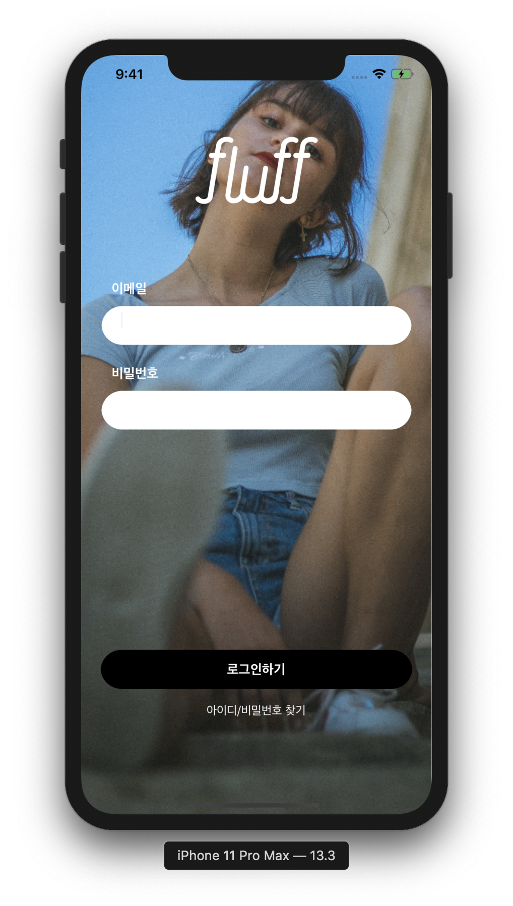

# Fluff_iOS

### Commit Message

- [Update], [Create], [Delete] 시작 메세지는 이렇게
- 메세지를 ViewController의 '스크롤링 기능 구현'

### Code Convention

* 서로 파일 만들 때, 직관적으로 알아볼 수 있는지 물어보기
* ViewController 같은 경우 ==> ~~VC
* 변수명은 Lower Camel 사용 
* 함수명도 Lower Camel 사용
* Extension 이름 ==> UIViewController+Extension
* TableView Extension 경우 ==> 따로 분리하여 기능별로
* 남의 스토리보드 절대 건들지 말기
* Optional 변수 (!) 사용 지양하기 ==> guard let 적극 활용

### 라이브러리

- 'Alamofire', '~> 4.8.2'
- 'KingFisher',`~> 5.4.0'

### 실행화면

**시작 화면**

### 어려운 것 해결한 것

1. Git Merge Conflict 해결
2. TableView 안 CollectionView 그리기
3. TableView Header 같이 스크롤 되게 만들기
4. CollectionView 레이아웃 잡기 (DelegateFlowLayout 안잡힘)
5. TextView Editing Point 잡기

6. Animationable Property가 존재

1️⃣ frame

2️⃣ bounds

3️⃣ center

4️⃣ transform

5️⃣ alpha

6️⃣ backgroundColor

7️⃣ contentStretch

7. TextView 사이즈 동적으로 조절하기