# Fluff_iOS

<br>

## Work Flow

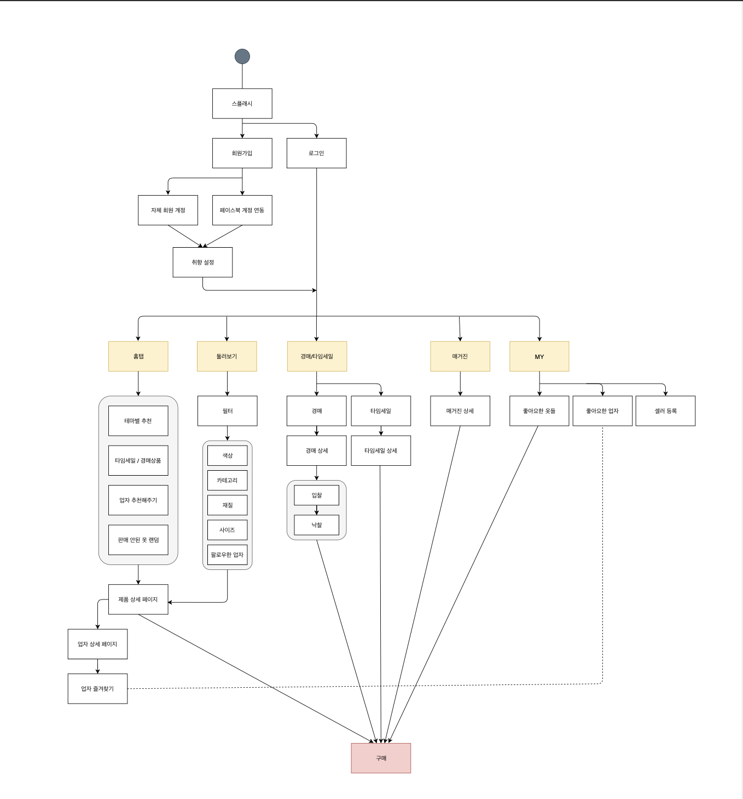

<br>

## Commit Message

🔵 [Update], [Create], [Fix] ➡️ **커밋 메세지 형식 통일**

🔵 한글로 변경된 폴더명, 기능 구현 순 ➡️ **커밋 메세지 통일**

<br>

## Code Convention

🔵 ViewController ==> `~~VC` 로 파일 통일 

🔵 변수명, 함수명 `Lower Camel` 사용

🔵 Extension 이름 ==> `확장클래스 + Extension`

🔵 `TableView`, `CollectionView` 의 Delegate, DataSource

```swift
class ViewController: UIViewController {}
extension ViewController: UITableViewDelegate {}
extension ViewController: UITableViewDataSource {}
```

🔵 Optional 변수 `guard let` 으로 바인딩하기

<br>

### 개발 환경

🔵 Xcode Version 11.3

🔵 Swift 5

<br>

### 라이브러리

✅ Alamofire

✅ KingFisher

✅ CHIPageControl

✅ XLPagerTabStrip

✅ BEMCheckBox

✅ Hero

<br>

### 실행화면

> **시작 화면**


<br>

> **시작화면 애니메이션**


<br>

> **회원가입**


<br>

> **회원가입 Progress Bar**


<br>

> **취향 분석**


<br>

> **취향 분석 애니메이션**


<br>

> **취향 분석 2**

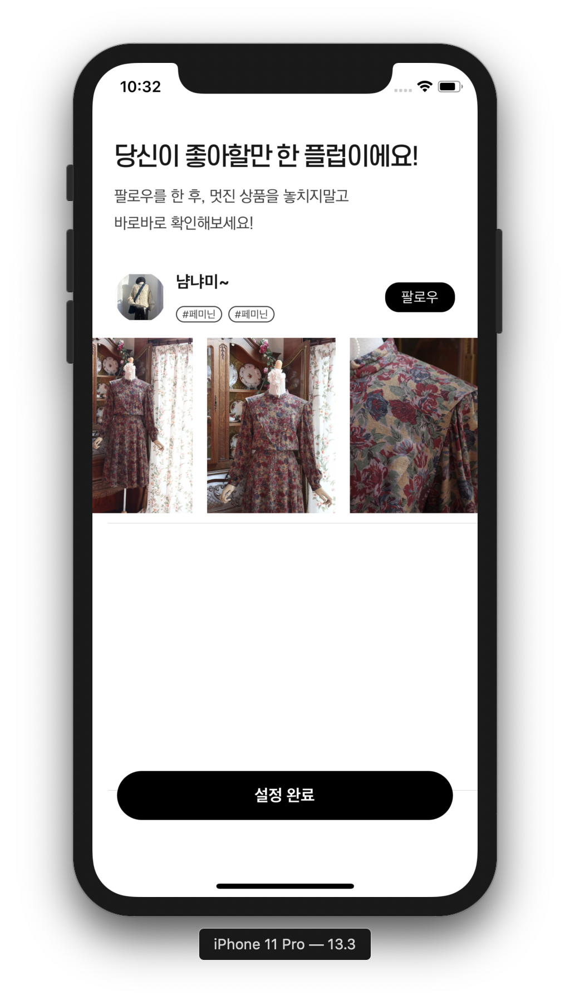

<br>

> **환영 화면**


<br>

> **메인 화면**


<br>

> **둘러보기**


<br>

> **필터 애니메이션**


<br>

> **상세 정보**

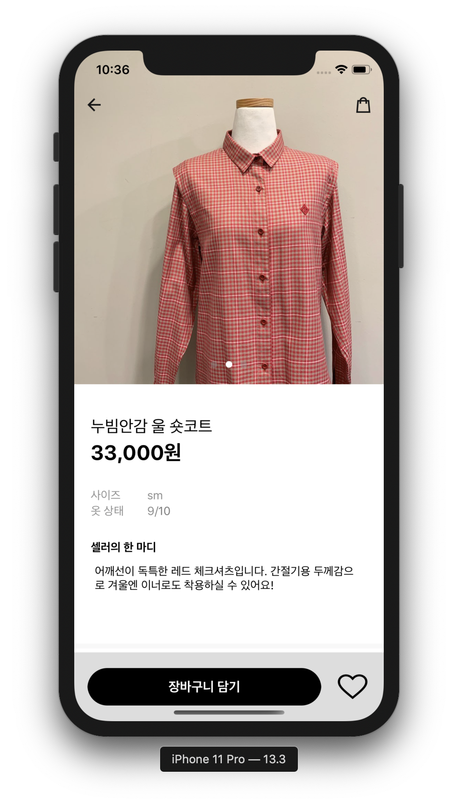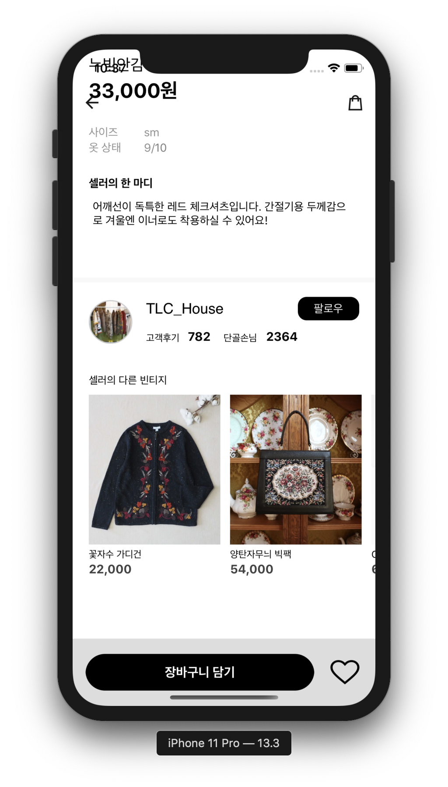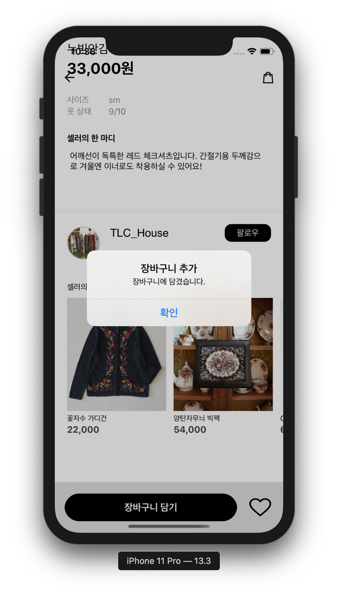

<br>

> **주문하기**


<br>

> **장바구니**

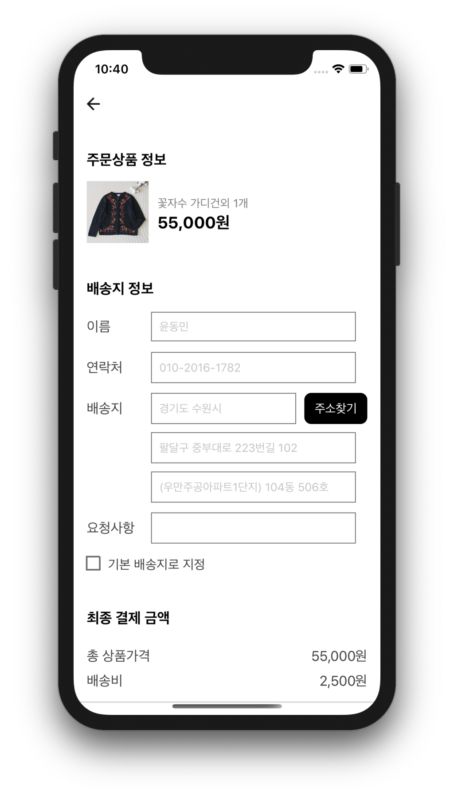

<br>

> **구매하기**

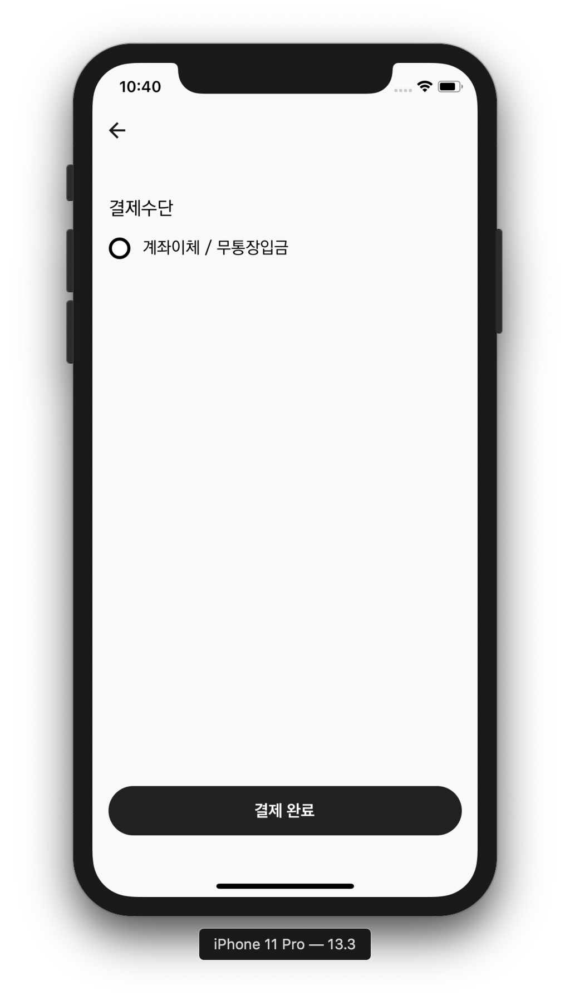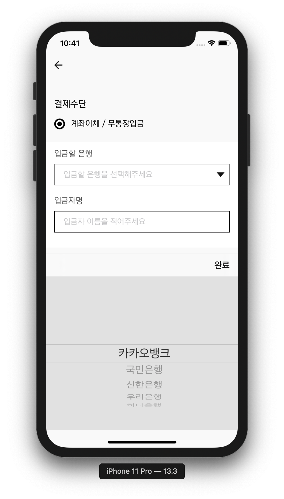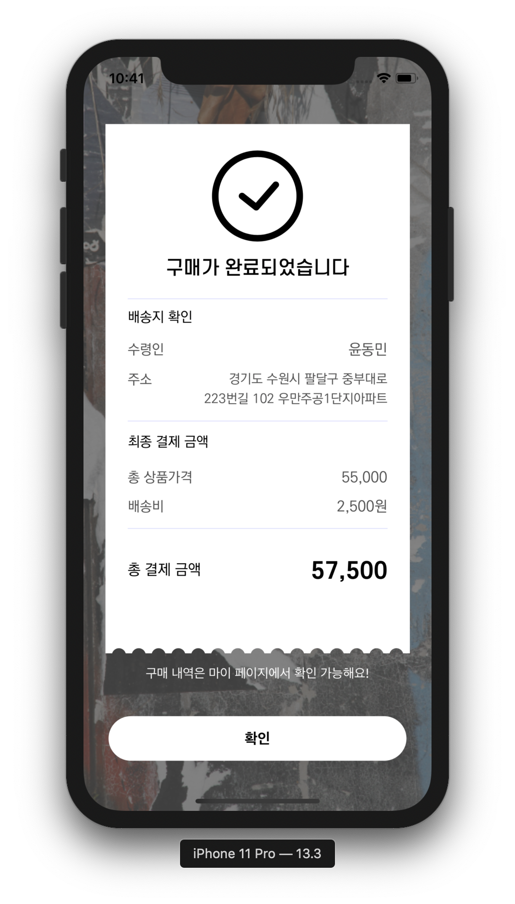

<br>

> **구매하기 애니메이션**

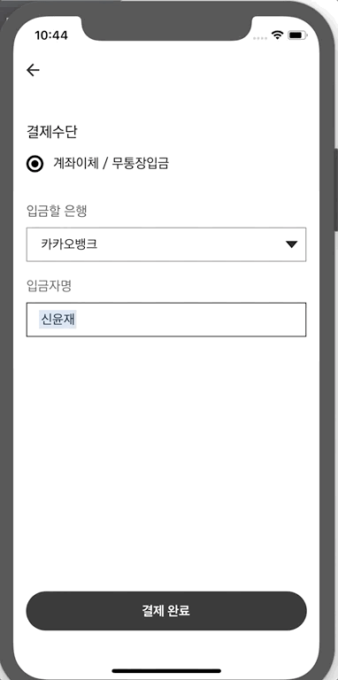

<br>

> **경매**


<br>

> **경매 애니메이션**


<br>

> **매거진**

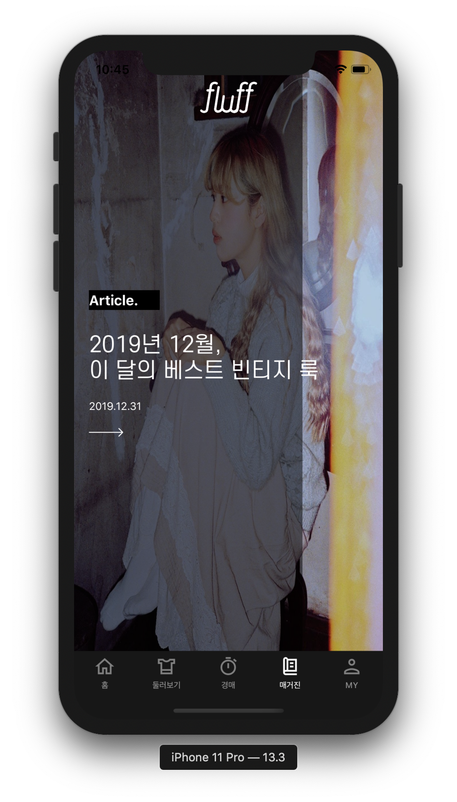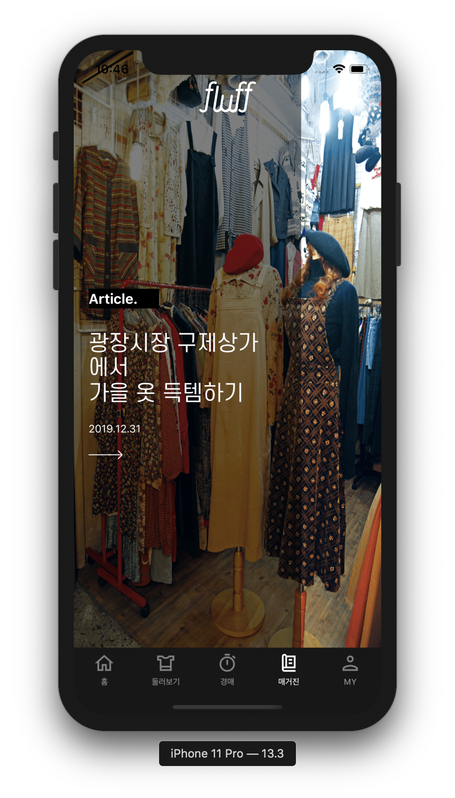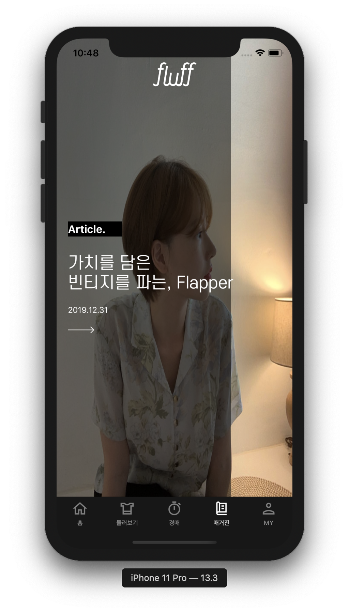

<br>

> **매거진 애니메이션**


<br>

> **마이페이지**


<br>

> **찜 목록**


<br>

<br>

### 기능 소개


**홈탭**

|      기능       | 개발여부 | 담당 |
| :-------------: | :------: | :--: |
| 로그인/회원가입 |    O     | 동민 |
|      홈탭       |    O     | 태진 |
|    둘러보기     |    O     | 동민 |
|      경매       |    △     | 동민 |
|     매거진      |    O     | 태진 |
|   마이페이지    |    △     | 동민 |
|     찜목록      |    X     |  😞   |
|     팔로우      |    X     |  😞   |

<br>

**세부기능**

|       기능        | 개발여부 | 담당 |
| :---------------: | :------: | :--: |
|     SNS로그인     |    X     |  🧐   |
|   홈탭 세부정보   |    O     | 태진 |
|   둘러보기 필터   |    △     | 동민 |
|   장바구니 담기   |    O     | 동민 |
| 장바구니 구매하기 |    O     | 동민 |
|   경매 소켓통신   |    △     | 동민 |
| 매거진 애니메이션 |    O     | 태진 |
|     취향 추천     |    O     | 👨‍👨‍👧‍👧 |
|     플럽 추천     |    O     | 👨‍👨‍👧‍👧 |

<br>

<br>

### 어려운 것 해결한 것

1. CollectionView 레이아웃 잡기 (DelegateFlowLayout 안잡힘)

🔵 Interface Builder AutoLayout 옵션에서 `None`으로 지정하면 코드로 지정한대로 설정

```swift
extension ViewController: UICollectionViewDelegateFlowLayout {
  // 상, 하, 좌, 우 Inset 지정
  func collectionView(_ collectionView: UICollectionView, layout collectionViewLayout: UICollectionViewLayout, insetForSectionAt section: Int) -> UIEdgeInsets {
    return UIEdgeInsets(top: 8, left: spacingWidth, bottom: 0, right: spacingWidth)
}
  // 세로 라인 Spacing 지정
	func collectionView(_ collectionView: UICollectionView, layout collectionViewLayout: UICollectionViewLayout, minimumLineSpacingForSectionAt section: Int) -> CGFloat {
    return 20
}
  // 가로 라인 Spacing 지정
  func collectionView(_ collectionView: UICollectionView, layout collectionViewLayout: UICollectionViewLayout, minimumInteritemSpacingForSectionAt section: Int) -> CGFloat {
    return 0
}
  // 각 셀 Size 지정
  func collectionView(_ collectionView: UICollectionView, layout collectionViewLayout: UICollectionViewLayout, sizeForItemAt indexPath: IndexPath) -> CGSize {
    return CGSize(width: collectionView.frame.width, height: collectionView.frame.height)
  }
}
```

<br>

2. Animationable Property가 존재

1️⃣ frame

2️⃣ bounds

3️⃣ center

4️⃣ transform

5️⃣ alpha

6️⃣ backgroundColor

7️⃣ contentStretch

<br>

3. ScrollView Delegate활용 PageControl ( ✅ `CHIPageControl` 사용 )

**페이지 번호 계산**

 현재 x 위치로 View의 Width을 나누어서 현재 페이지 계산 ➡️ Int 값으로 환산을 하면 페이지 값이 나온다.

```swift
func scrollViewWillEndDragging(_ scrollView: UIScrollView, withVelocity velocity: CGPoint, targetContentOffset: UnsafeMutablePointer<CGPoint>) {
  let page = Int(targetContentOffset.pointee.x / self.view.frame.width)
  pageControl.set(progress: page, animated: true)
}
```

<br>

4. UIView Blur 처리

```swift
var backgroundEffectView: UIVisualEffectView!		// Visual Effect을 넣을 수 있는 View

func setBlurView() {
  let blurEffect = UIBlurEffect(style: dark) 		// Blur Effect 넣을 수 있는 것 생성
  backgroundEffectView.effect = blurEffect			// UIVisualEffectView에 Blur효과 적용
}
```

<br>

5. 전체 레이아웃이 제대로 적용 안되는 문제 iPhone 11 Pro Max 에서 작업 후 ==> iPhone 11 Pro에 적용할 경우 레이아웃이 Pro Max로 적용되어 Button의 Radius가 적용이 안됨

```swift
// Layout 관련 메소드 공부들 더 필요
// View의 SubView들의 레이아웃 관련해서 다시 잡아줄 필요가 있을 경우
// 이 함수에서 View들의 Layout을 다시 리셋시켜주면서 잡아준다.
// iPhone11 Pro Max를 기준으로 잡혀있던 것을 iPhone 11 Pro을 기준으로 다시 잡을 수 있게 해준다.
override func viewDidLayoutSubviews() {
  super.viewDidLayoutSubviews()
  initColorButtons()
}
```

<br>

6. StackView 이용 Animation 적용 AutoLayout 잡아주기

🔵 필터를 적용했을 때만 선택하는 메뉴에서 StackView을 활용 오토레이아웃을 잡아주었다. `isHidden` 옵션 활용

```swift
detailFilterView.isHidden = false
// setNeedsLayout 필요 isHidden 후 ==> 이 부분도 공부 필요
self.view.setNeedsLayout()
UIView.animate(withDuration: 1, delay: 0, usingSpringWithDamping: 0.8, initialSpringVelocity: 0, options: .curveEaseInOut, animations: {
                    self.view.layoutIfNeeded()
// 보통 isHidden 후 나타날때, 화면 버벅거리는 문제로 layoutIfNeeded() 필요
// 여기도 공부 필요
                }, completion: nil)
```

<br>

7. 가장 상위 View로 띄우기 (Navigation Bar, Tab Bar 위로 View가 올라옴)

```swift
guard let window = UIApplication.shared.keyWindow else { return }
window.addSubView(UIView())
```

<br>

8. Tabbar `isHidden` 을 Bottom에 Spacing이 생기는 문제

```swift
// hideBottomBarWhenPushed을 넘어가는 View에 설정
private func setTabbar() {
  self.hidesBottomBarWhenPushed = true
}
```

<br>

9. 서버 데이터를 처리할 때, 서버에서 Key값 처리하는 경우

 🔵 `JSON` 에서 항상 Key값은 String이니깐 CodingKeys라는 enum은 CodingKey라는 프로토콜을 채택하게 한다.

🔵 `JSON` 타입에서 name의 키가 있을 경우 ➡️ myName으로 대입

🔵 `JSON` 타입에서 age의 키가 있을 경우 ➡️ myAge으로 대입

```swift
struct Person: Codable {
  var myName: String
  var myAge: Int?
  
  enum CodingKeys: String, CodingKey {
    case myName = "name"
    case myAge = "age"
  }
  
  init(from decoder: Decoder) throws {
    let values = try decoder.container(keyedBy: CodingKeys.self)
    myName = (try? values.decode(String.self, forkey: .myName)) ?? ""
    myAge = (try? values.decode(String.self, forkey: .myAge)) ?? nil
  }
}
```

<br>

10. `Dictionary` 타입 Value값으로 Sorting하기

```swift
// key, value 순으로 Sorting ==> value의 값을 기준으로 큰 값이 왼쪽에 오게 바꾸기
let sortedParameter = surveyResult.sorted { $0.1 > $1.1 }
            let sortingKey = [sortedParameter[0].key, sortedParameter[1].key, sortedParameter[2].key]
```

<br>

11. 키보드가 View 터치 Keyboard Down Event 발생

```swift
self.view.endEditting(true)
```

<br>

12. NavigationBar에 BarButtonItem 코드로 추가하기

```swift
private func setNaviBackButton() {
  self.navigationItem.leftBarButtonItem = UIBarButtonItem(image: UIImage(named: "10"), style: .done, target: self, action: #selector(popView))
  self.navigationController?.navigationBar.topItem?.title = ""
}

@objc func popView() {
  self.navigationController?.popViewController(animated: true)
}
```

<br>

13. `TableView`  선택 후, 다음뷰로 넘어갔다 올 때 선택된 영역 해제하기

```swift
override func viewDidDisappear(_ animated: Bool) {
  super.viewDidDisappear(animated)
	if let index = myPageButtonTableView.indexPathForSelectedRow {
    myPageButtonTableView.deselectRow(at: index, animated: true)
  }
}
```

<br>

14. `TableView` 밑줄 라인이 비는 현상 해결 ➡️ 비는 공간 없게

```swift
func tableView(_ tableView: UITableView, cellForRowAt indexPath: IndexPath) -> UITableViewCell {
  guard let cartCell = tableView.dequeueReusableCell(withIdentifier: "cartCell") as? CartTableViewCell else { return UITableViewCell() }
  // zero로 주면 문제 해결 좌공간 Inset이 0으로 설정된다.
  cartCell.separatorInset = UIEdgeInsets.zero
}
```

<br>

15. 카메라 사용하기 `UIImagePicker`  사용

✅ Info.plist Camera, Galary 접근 권한 설정 필수, UIImagePickeroControllerDelegate 설정 필수

```swift
extension FluvApplyVC: UIImagePickerControllerDelegate, UINavigationControllerDelegate {
    func openLibrary() {
        imagePicker.sourceType = .photoLibrary
        present(imagePicker, animated: false, completion: nil)
    }
    
    func openCamera() {
        if UIImagePickerController.isSourceTypeAvailable(.camera) {
            imagePicker.sourceType = .camera
        } else {
        }
        present(imagePicker, animated: false, completion: nil)
    }
    
    func imagePickerController(_ picker: UIImagePickerController, didFinishPickingMediaWithInfo info: [UIImagePickerController.InfoKey : Any]) {
        if let image = info[UIImagePickerController.InfoKey.originalImage] as? UIImage {
            profileImage = image
            profileButton.setBackgroundImage(profileImage, for: .normal)
            dismiss(animated: true, completion: nil)
        }
    }
}
```

<br>

16. `NumberFormatter` 사용 숫자 구분

```swift
// 3자리부터 단위 사용하게 구분
let numberFormatter = NumberFormatter()
numberFormatter.style = .decimal

let text = numberFormatter.string(from: NSNumber(value: styleData[indexPath.row].price))! + "원"

```

<br>

### 참가자

* [iOS - 오태진](https://github.com/ORANZINO) 

* [iOS - 윤동민](https://github.com/dongminyoon )

