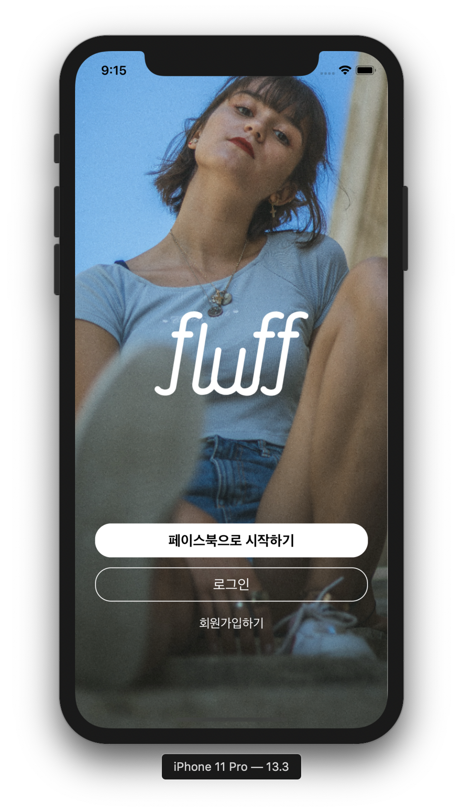
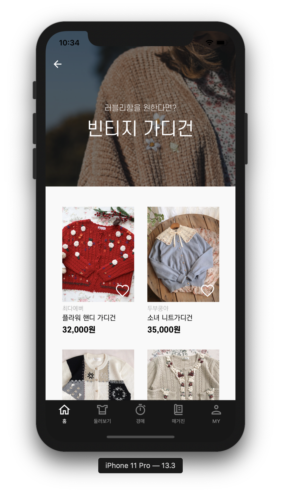
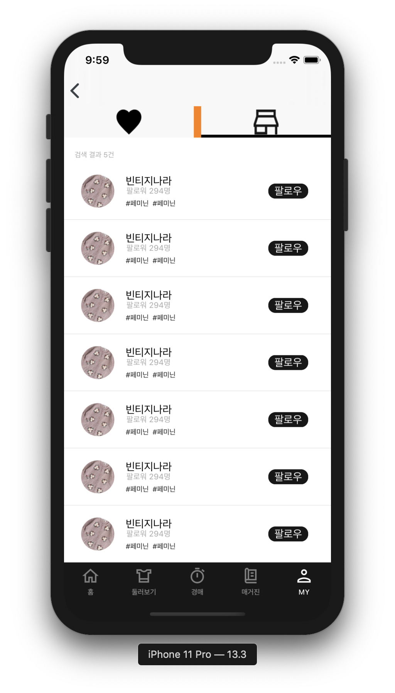

# Fluff_iOS


## Work Flow


## Commit Message

🔵 [Update], [Create], [Fix] ➡️ **커밋 메세지 형식 통일**

🔵 한글로 변경된 폴더명, 기능 구현 순 ➡️ **커밋 메세지 통일**


## Code Convention

🔵 ViewController ==> `~~VC` 로 파일 통일 

🔵 변수명, 함수명 `Lower Camel` 사용

🔵 Extension 이름 ==> `확장클래스 + Extension`

🔵 `TableView`, `CollectionView` 의 Delegate, DataSource

```swift
class ViewController: UIViewController {}
extension ViewController: UITableViewDelegate {}
extension ViewController: UITableViewDataSource {}
```

🔵 Optional 변수 `guard let` 으로 바인딩하기


### 개발 환경

🔵 Xcode Version 11.3

🔵 Swift 5


### 라이브러리

✅ Alamofire

✅ KingFisher

✅ CHIPageControl

✅ XLPagerTabStrip

✅ BEMCheckBox

✅ Hero


### 실행화면

> **시작 화면**




> **시작화면 애니메이션**


> **회원가입**


> **회원가입 Progress Bar**


> **취향 분석**


> **취향 분석 애니메이션**


> **취향 분석 2**


> **환영 화면**


> **메인 화면**




> **둘러보기**


> **필터 애니메이션**


> **상세 정보**


> **주문하기**


> **장바구니**


> **경매**


> **경매 애니메이션**


> **마이페이지**


> **찜 목록**




### 기능 소개

* **회원 가입 입력창**

1️⃣ 정규식 이용하여 이메일 형식, 비밀번호 형식으로 입력 검사


* **로그인 애니메이션** 

1️⃣ X, Y 상대 값 계산하여 애니메이션 되게 설정

2️⃣ `.identity` 기능 활용 원상태로 복귀


* **필터 기능**

1️⃣ 색상 1가지, 카테고리 1가지, 세부 카테고리 복수개, 사이즈 복수개 선택가능

2️⃣ Clear 누를 시, 모든 선택 된 필터들 해제

3️⃣ 적용 클릭 시, 서버로 해당 필터 내용 전달 후 데이터 통신


* **경매 기능**

1️⃣ 서버와 클라이언트 Socket을 통해 구현예정


### 어려운 것 해결한 것

4. CollectionView 레이아웃 잡기 (DelegateFlowLayout 안잡힘)

🔵 Interface Builder AutoLayout 옵션에서 `None`으로 지정하면 코드로 지정한대로 설정

```swift
extension ViewController: UICollectionViewDelegateFlowLayout {
  // 상, 하, 좌, 우 Inset 지정
  func collectionView(_ collectionView: UICollectionView, layout collectionViewLayout: UICollectionViewLayout, insetForSectionAt section: Int) -> UIEdgeInsets {
    return UIEdgeInsets(top: 8, left: spacingWidth, bottom: 0, right: spacingWidth)
}
  // 세로 라인 Spacing 지정
	func collectionView(_ collectionView: UICollectionView, layout collectionViewLayout: UICollectionViewLayout, minimumLineSpacingForSectionAt section: Int) -> CGFloat {
    return 20
}
  // 가로 라인 Spacing 지정
  func collectionView(_ collectionView: UICollectionView, layout collectionViewLayout: UICollectionViewLayout, minimumInteritemSpacingForSectionAt section: Int) -> CGFloat {
    return 0
}
  // 각 셀 Size 지정
  func collectionView(_ collectionView: UICollectionView, layout collectionViewLayout: UICollectionViewLayout, sizeForItemAt indexPath: IndexPath) -> CGSize {
    return CGSize(width: collectionView.frame.width, height: collectionView.frame.height)
  }
}
```


2. Animationable Property가 존재

1️⃣ frame

2️⃣ bounds

3️⃣ center

4️⃣ transform

5️⃣ alpha

6️⃣ backgroundColor

7️⃣ contentStretch


3. ScrollView Delegate활용 PageControl ( ✅ `CHIPageControl` 사용 )

**페이지 번호 계산**

 현재 x 위치로 View의 Width을 나누어서 현재 페이지 계산 ➡️ Int 값으로 환산을 하면 페이지 값이 나온다.

```swift
func scrollViewWillEndDragging(_ scrollView: UIScrollView, withVelocity velocity: CGPoint, targetContentOffset: UnsafeMutablePointer<CGPoint>) {
  let page = Int(targetContentOffset.pointee.x / self.view.frame.width)
  pageControl.set(progress: page, animated: true)
}
```


4. UIView Blur 처리

```swift
var backgroundEffectView: UIVisualEffectView!		// Visual Effect을 넣을 수 있는 View

func setBlurView() {
  let blurEffect = UIBlurEffect(style: dark) 		// Blur Effect 넣을 수 있는 것 생성
  backgroundEffectView.effect = blurEffect			// UIVisualEffectView에 Blur효과 적용
}
```


5. 전체 레이아웃이 제대로 적용 안되는 문제 iPhone 11 Pro Max 에서 작업 후 ==> iPhone 11 Pro에 적용할 경우 레이아웃이 Pro Max로 적용되어 Button의 Radius가 적용이 안됨

```swift
// Layout 관련 메소드 공부들 더 필요
// View의 SubView들의 레이아웃 관련해서 다시 잡아줄 필요가 있을 경우
// 이 함수에서 View들의 Layout을 다시 리셋시켜주면서 잡아준다.
// iPhone11 Pro Max를 기준으로 잡혀있던 것을 iPhone 11 Pro을 기준으로 다시 잡을 수 있게 해준다.
override func viewDidLayoutSubviews() {
  super.viewDidLayoutSubviews()
  initColorButtons()
}
```


6. StackView 이용 Animation 적용 AutoLayout 잡아주기

🔵 필터를 적용했을 때만 선택하는 메뉴에서 StackView을 활용 오토레이아웃을 잡아주었다. `isHidden` 옵션 활용

```swift
detailFilterView.isHidden = false
// setNeedsLayout 필요 isHidden 후 ==> 이 부분도 공부 필요
self.view.setNeedsLayout()
UIView.animate(withDuration: 1, delay: 0, usingSpringWithDamping: 0.8, initialSpringVelocity: 0, options: .curveEaseInOut, animations: {
                    self.view.layoutIfNeeded()
// 보통 isHidden 후 나타날때, 화면 버벅거리는 문제로 layoutIfNeeded() 필요
// 여기도 공부 필요
                }, completion: nil)
```


7. 가장 상위 View로 띄우기 (Navigation Bar, Tab Bar 위로 View가 올라옴)

```swift
guard let window = UIApplication.shared.keyWindow else { return }
window.addSubView(UIView())
```


### 참가자

* 오태진 - iOS
* 윤동민 - iOS